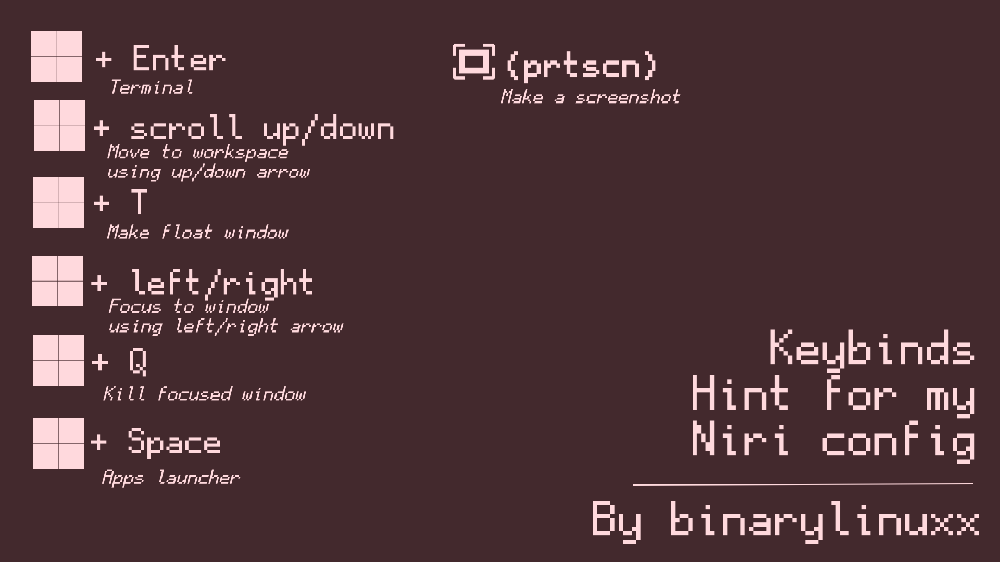

# Niri Material You  
My dotfiles of Niri using Material You colors + Matugen  

## Screens  
---  
  

## Keybinds  
---  
  

## DESC RU
эти конфиги я делал когда захотелось эксперементов с Material You когда обычные все возможные GTK темы уже надоели
pywal тоже надоел, конфиги я делал сам без какой либо помощи и могут быть какие либо баги но зачем это скачевать зная что могут быть баги?
только если вы также как и я хотите поиграть с Material You и вообще если не уверены лучше
на VM запускайте.

## DESC EN
These configs were created when I wanted to experiment with Material You, as I got tired of the every possible usual GTK themes.
Pywal also became boring, and I made these configs entirely on my own without any assistance, so there might be some bugs. But why download it knowing there could be bugs?
Only if you, like me, want to play around with Material You. And in general, if you're not sure, it's better to run it on a VM.

## TO-DO
- [goals]:
 - [install script] [ ]
 - [make GTK THEME DEPENDS on wallpaper] [X]. requires[mitsugen](https://github.com/DimitrisMilonopoulos/mitsugen)
 - [EWW battery widget] [ ]

## OTHERS COOL PROJECTS
[BSPWM BY SOPHRON](https://github.com/sophragoz/dots)

[MY COLLECTION OF DOTFILES](https://github.com/binarylinuxx/binary-dots)
